# Дипломная работа. 
##### Автор: <b>Старков Андрей</b>.
---
### Этапы выполнения:
## 1.Создание облачной инфраструктуры

Для начала необходимо подготовить облачную инфраструктуру в ЯО при помощи Terraform.

Особенности выполнения:

- Бюджет купона ограничен, что следует иметь в виду при проектировании инфраструктуры и использовании ресурсов;
Для облачного k8s используйте региональный мастер(неотказоустойчивый). Для self-hosted k8s минимизируйте ресурсы ВМ и долю ЦПУ. В обоих вариантах используйте прерываемые ВМ для worker nodes.

Ожидаемые результаты:

1. Terraform сконфигурирован и создание инфраструктуры посредством Terraform возможно без дополнительных ручных действий, стейт основной конфигурации сохраняется в бакете или Terraform Cloud
2. Полученная конфигурация инфраструктуры является предварительной, поэтому в ходе дальнейшего выполнения задания возможны изменения.
---
### 1.Решение
Разобьем нашу инфраструктуру на две части:
1. Первая часть backend<br>
>В данном случаи я создаю сервисный аккаут, с3 хранилище и файла provider.tf и файл с переменными bucket.auto.tfvars (для с3 хранилища) для второй части инфраструктуры. Все манифесты расположены в папке <b>[bucket](./bucket/)</b> за исключениям служебных файлов и файлов с чувствительными данными, таки как personal.auto.tfvars. Переменный в данном файле выглядят следующим образом:
```
token  =  "<токен_для_подключения_к_ЯО>"
cloud_id  = "<айди_для_подключения_к_ЯО>"
folder_id = "<пространство_для_подключения_к_ЯО>"
``` 
<p align="center">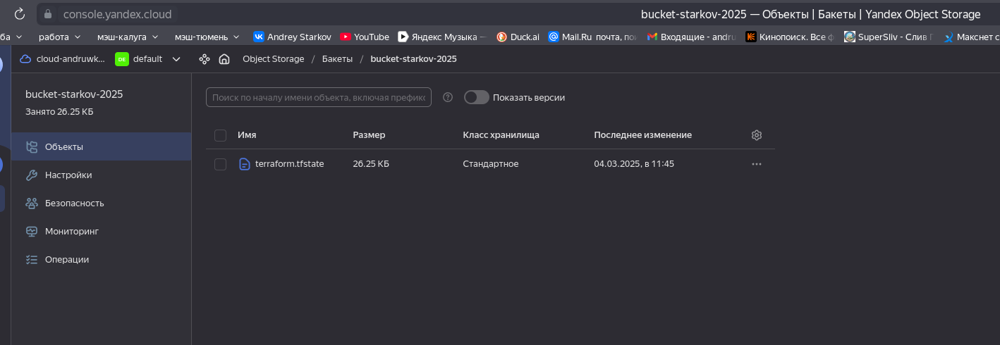</p><br>
 
2. Вторая часть, основная инфраструктура<br>
>Конфиг создающий ноды кластера [k8s](./terraform/k8s.tf), в данном случаи я описал ноды через счетчик count ```counts_masters``` и ```counts_workers``` для более простого и быстрого масштабирования инфраструктуры, шлюз для кластера - [бастион](./terraform/k8s.tf), а так же [сети и таблицы маршрутизации](./terraform/network.tf)   
<p align="center">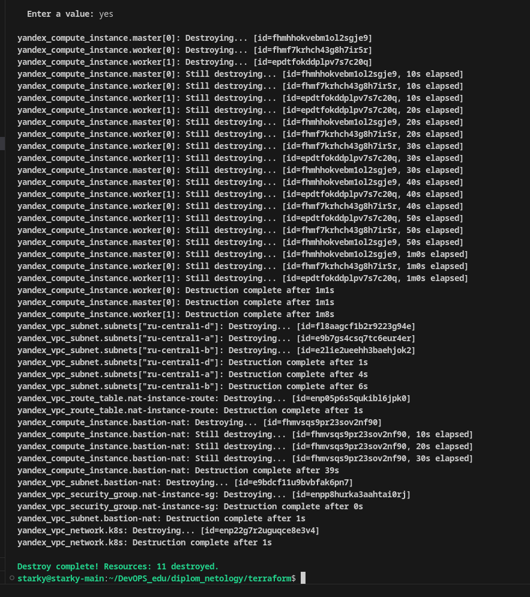</p><br>
<p align="center">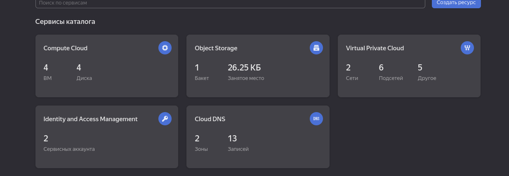</p><br>
<p align="center">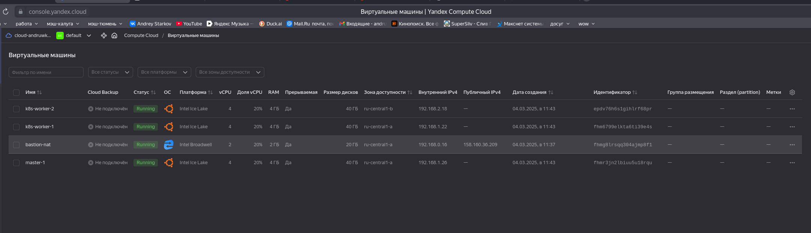</p><br>
<p align="center">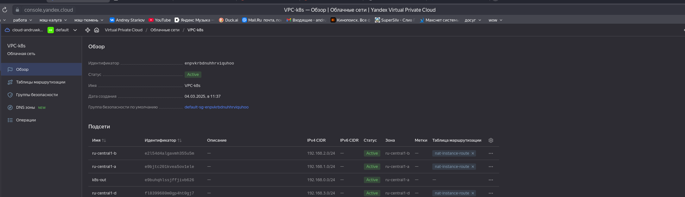</p><br>

После создания инфраструктуры, на основе шаблона [inventory.tftpl](./terraform/inventory.tftpl) создается инвентари конфиг для ansible-playbook в папке [ansible](./ansible/hosts.yml). Как и в предыдущем случаи все конфиги предтсавлены в папке [terraform](./terraform/) за исключением personal.auto.tfvars и bucket.auto.tfvars. Данные файлы имеют следующий вид:
<br>personal.auto.tfvars</br>
```
token  =  "<токен_для_подключения_к_ЯО>"
cloud_id  = "<айди_для_подключения_к_ЯО>"
folder_id = "<пространство_для_подключения_к_ЯО>"
ssh_key = "<публичный_ключ_для_аутентификации>"
```
<br>bucket.auto.tfvars</br>
```
bucket = "<имя_бакета>"
access_key = "<ключ_доступа_к_хранилищу>"
secret_key = "<секретный_ключ_к_храниллищу>"
```
---

## 2.Создание Kubernetes кластера

На этом этапе необходимо создать Kubernetes кластер на базе предварительно созданной инфраструктуры.   Требуется обеспечить доступ к ресурсам из Интернета.

Ожидаемый результат:

1. Работоспособный Kubernetes кластер.
2. В файле `~/.kube/config` находятся данные для доступа к кластеру.
3. Команда `kubectl get pods --all-namespaces` отрабатывает без ошибок.
---
### 2.Решение
За основу была взята роль для [ansible](https://vk.com/@kodepteam-sozdanie-kubernetes-klastera-pri-pomoschi-ansible-rolei-i-mu) и переделана под [актуальное](./ansible/k8s-cluster/) состояние (например настройка сети и т.д.).
>Запускать playbook необходимо с параметром '-o StrictHostKeyChecking=no':

```ansible-playbook -i hosts.yml ./k8s-cluster/playbook.yml --ssh-common-args='-o StrictHostKeyChecking=no' ```
<p align="center"></p><br>
<p align="center">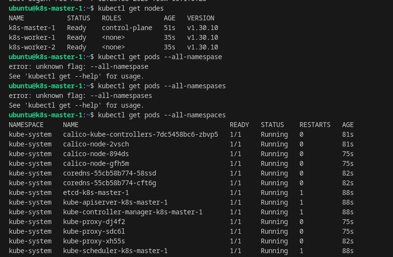</p><br>

---
## 3.Создание тестового приложения

Для перехода к следующему этапу необходимо подготовить тестовое приложение, эмулирующее основное приложение разрабатываемое вашей компанией.

Ожидаемый результат:

1. Git репозиторий с тестовым приложением и Dockerfile.
2. Регистри с собранным docker img/image. В качестве регистри может быть DockerHub или Yandex Container Registry, созданный также с помощью terraform.

---
### 3.Решение
В качестве тестового приложения был выбран образ nginx со статической страничкой. Был создан отдельный репозиторий [app_for_diplom](https://github.com/starky29/app_for_diplom).
Для начала подготовил образ локально на своей машине
<p align="center">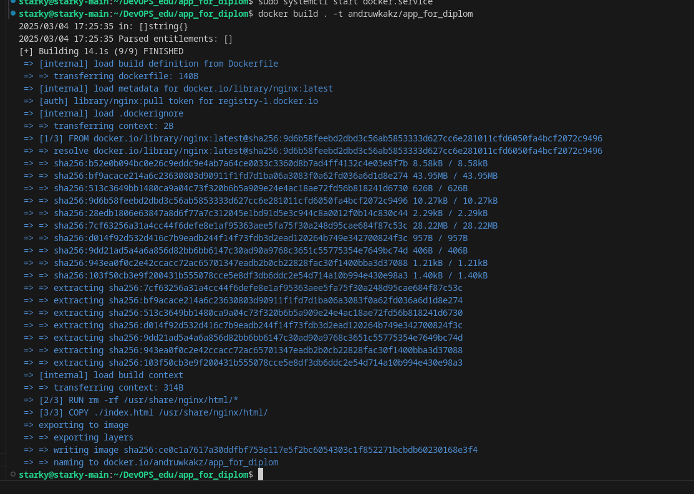</p><br>
Для проверки работы образа, запустил образ локально с проброской портов с 80 на 8080 локального компьютера
<p align="center"></p><br>
Загрузил образ в docker registry
<p align="center">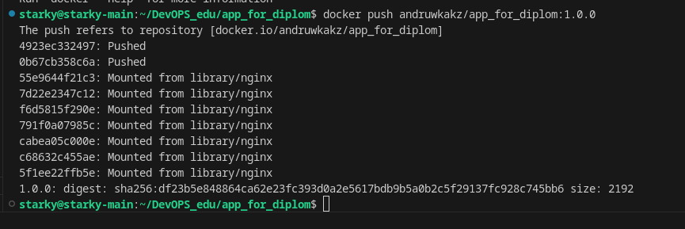</p><br>
<p align="center">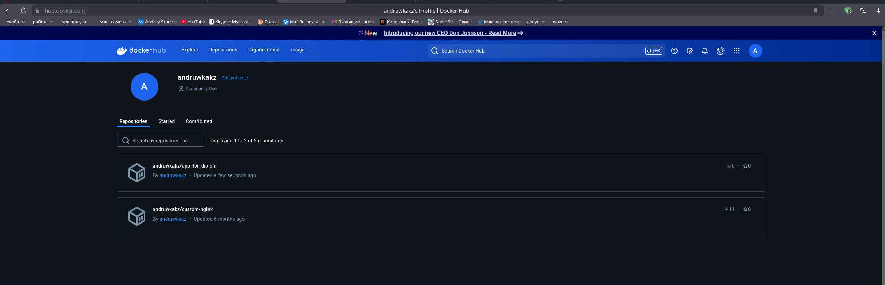</p><br>

  
---
## 4.Подготовка cистемы мониторинга и деплой приложения

Уже должны быть готовы конфигурации для автоматического создания облачной инфраструктуры и поднятия Kubernetes кластера.  
Теперь необходимо подготовить конфигурационные файлы для настройки нашего Kubernetes кластера.

Цель:
1. Задеплоить в кластер prometheus, grafana, alertmanager, экспортер основных метрик Kubernetes.
2. Задеплоить тестовое приложение, например, nginx сервер отдающий статическую страницу.

Ожидаемый результат:
1. Git репозиторий с конфигурационными файлами для настройки Kubernetes.
2. Http доступ на 80 порту к web интерфейсу grafana.
3. Дашборды в grafana отображающие состояние Kubernetes кластера.
4. Http доступ на 80 порту к тестовому приложению.
5. Atlantis или terraform cloud или ci/cd-terraform
---
### 4.Решение
Для начала задеплоил [nginx-controller](./manifests/ing-mon-nginx.yaml), а также добавил в конфигурацию инфраструктуры [балансер](./terraform/balancer.tf), который будет выводить наружу приложение и мониторинг

Добавил роль [gaps](./ansible/k8s-cluster/roles/gaps/) в ansible-playbook для диплоя [kube-prometheus](https://github.com/prometheus-operator/kube-prometheus) в кластер. С данным репозиторием есть ньюанс, он создает сервис графаны на 80 порт, для того что бы автоматизировать нужные мне настройки было принято решение удалить данный сервис (посредствам ансибл плэйбука) и добавить свой сервис для [grafana](./manifests/garafana-svc.yaml)
<p align="center">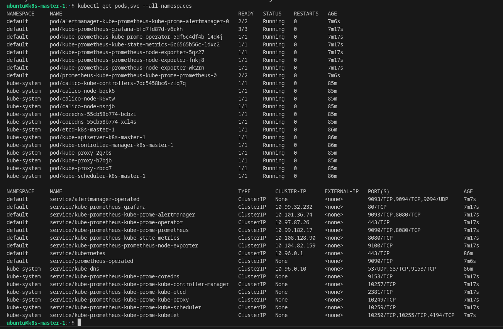</p><br>
<p align="center">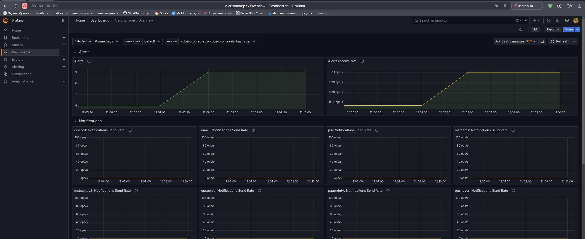</p><br>

Задеплоил [приложение](./manifests/app.yaml)
<p align="center">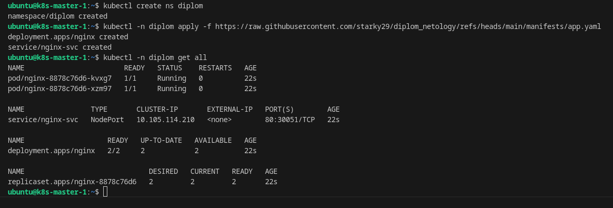</p><br>
<p align="center">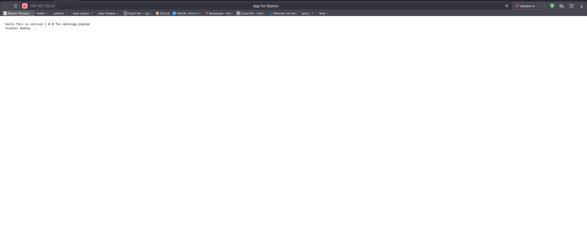</p><br>

>Задача по автоматизации отслеживания инфраструктуры была реализована с помощью CI/CD с помощью GitHub Actions. Данное решение было принято в связи с тем что доступ к Terraform Cloud закрыт для адресов из России,  Atlantis server для дашбордов использует сервис NGROK который так же не доступен с Российскими адресами.

Для переноса деплоя инфрастуркутры пришлось внести некоторые корректировки,чувствительные данные из файлов personal.auto.tfvars и bucket.auto.tfvars, были перенесены в секреты репозитория
<p align="center">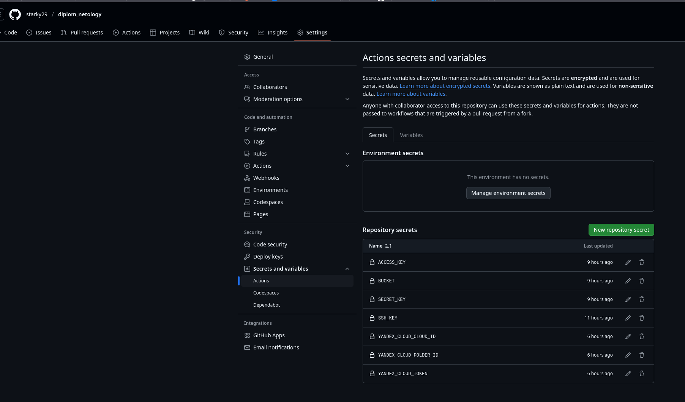</p><br>

Конфиг [пайплайна](.github/workflows/infrastructure.yml).

В пайплайне присутствуют 3 джобы, одна обязательная ``Plan-infrastructur``(данная джоба запускается при любом каммите и дальнейшем пуше в ветку main, а также при пул реквестах) для ознакомления и две зависящие от нее, а так же от <b>слова</b> в каммите. Если в каммите пристсвтует слово ``apply``, то полсе ``Plan-infrastructur``  запускается ``Apply-infrastructur``: 

<p align="center">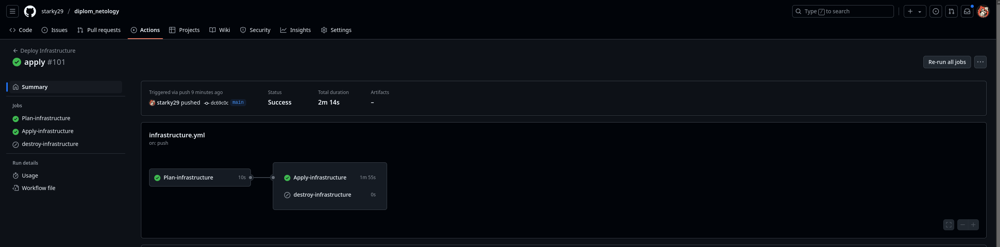</p><br>
<p align="center">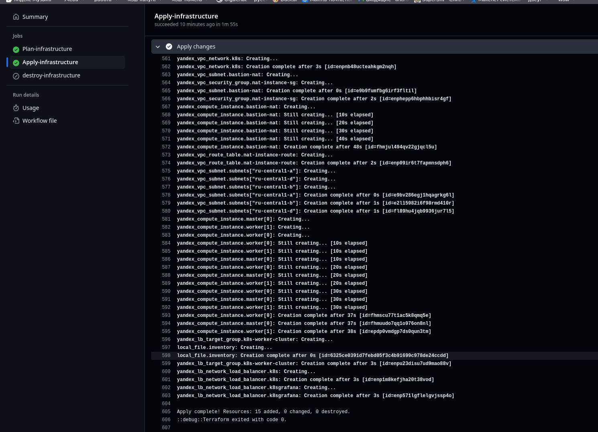</p><br>

Если же в каммите присутствует слово ``destroy``, полсе ``Plan-infrastructur``  запускается ``Destroy-infrastructur``:

<p align="center">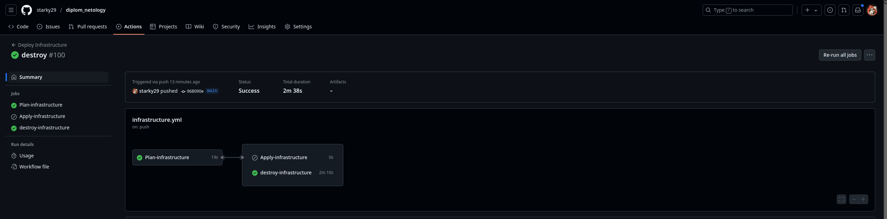</p><br>
<p align="center">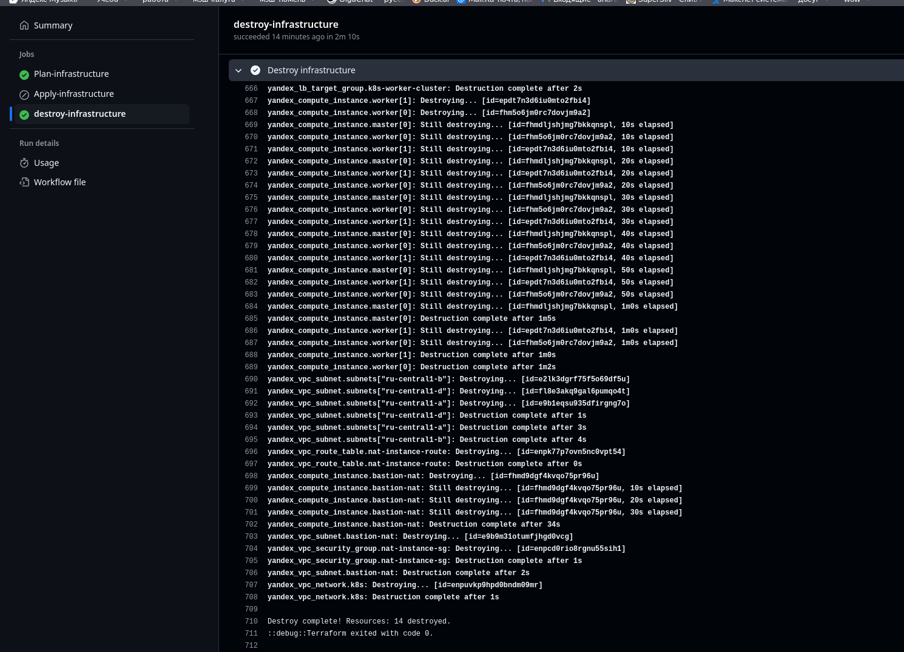</p><br>

---
## 5.Установка и настройка CI/CD

Осталось настроить ci/cd систему для автоматической сборки docker img/image и деплоя приложения при изменении кода.

Цель:

1. Автоматическая сборка docker образа при коммите в репозиторий с тестовым приложением.
2. Автоматический деплой нового docker образа.

Ожидаемый результат:

1. Интерфейс ci/cd сервиса доступен по http.
2. При любом коммите в репозиторие с тестовым приложением происходит сборка и отправка в регистр Docker образа.
3. При создании тега (например, v1.0.0) происходит сборка и отправка с соответствующим label в регистри, а также деплой соответствующего Docker образа в кластер Kubernetes.
---
### 5.Решение
Подготовил секреты для авторизации на docker registry
<p align="center">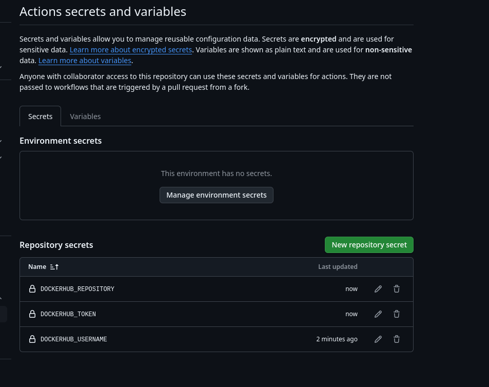</p><br>

Настроил runner на одной из нод кластера куба
<p align="center">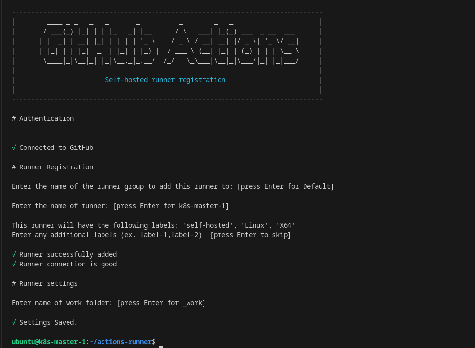</p><br>

Настраиваем workflow [файл](starky29/app_for_diplom/.github/workflows/ci-cd.yaml) для ci/cd и тестируем диплой прилодения
<p align="center">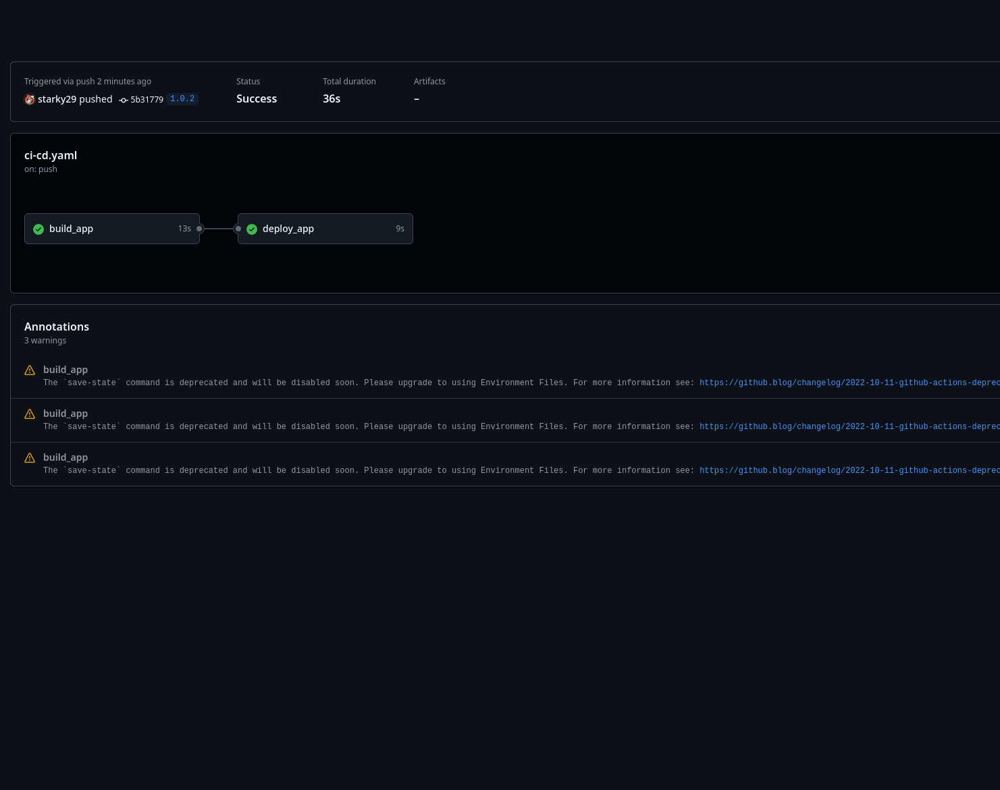</p><br>
<p align="center">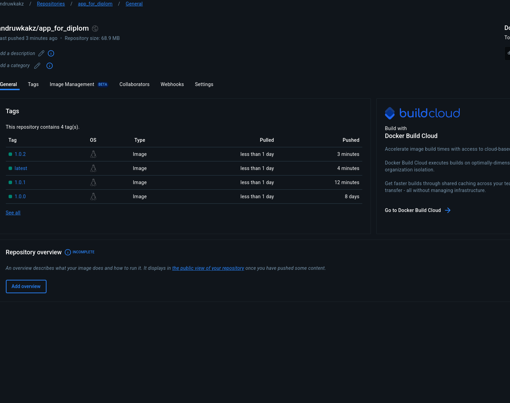</p><br>
<p align="center">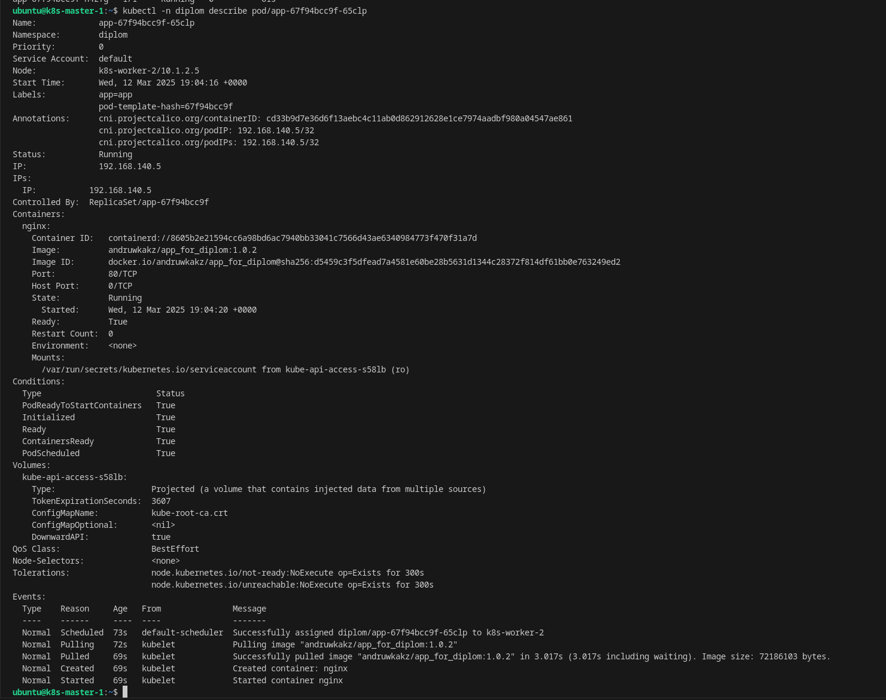</p><br>

---