# Дипломная работа

## Этапы выполнения:


### 1.Создание облачной инфраструктуры

Для начала необходимо подготовить облачную инфраструктуру в ЯО при помощи Terraform.

Особенности выполнения:

- Бюджет купона ограничен, что следует иметь в виду при проектировании инфраструктуры и использовании ресурсов;
Для облачного k8s используйте региональный мастер(неотказоустойчивый). Для self-hosted k8s минимизируйте ресурсы ВМ и долю ЦПУ. В обоих вариантах используйте прерываемые ВМ для worker nodes.

Ожидаемые результаты:

1. Terraform сконфигурирован и создание инфраструктуры посредством Terraform возможно без дополнительных ручных действий, стейт основной конфигурации сохраняется в бакете или Terraform Cloud
2. Полученная конфигурация инфраструктуры является предварительной, поэтому в ходе дальнейшего выполнения задания возможны изменения.
---
## 1.Решение
Создание сервисного аккаунта а так же подготовка [backend](./bucket/) выполняется конфигом терраформа расположенном в папке backend
* 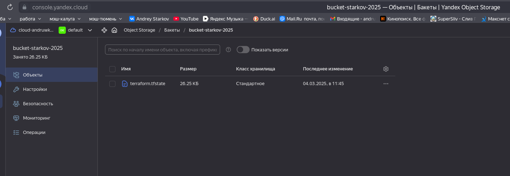
Конфиг для терраформа создающий ноды кластера, шлюз, а так же сети (таблицы маршрутизации) находиться в папке terraform
* 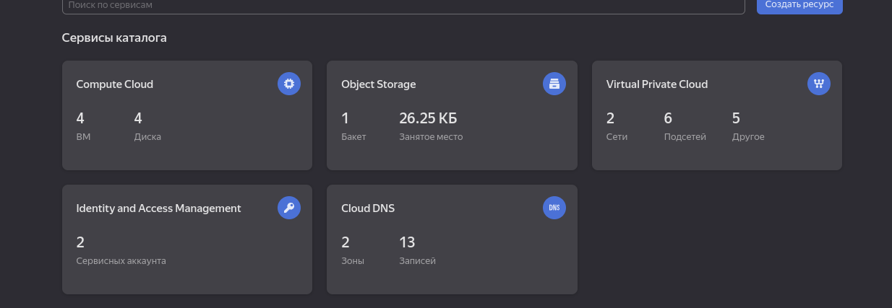
* 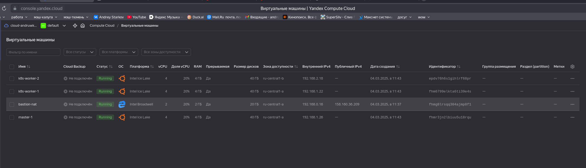
* 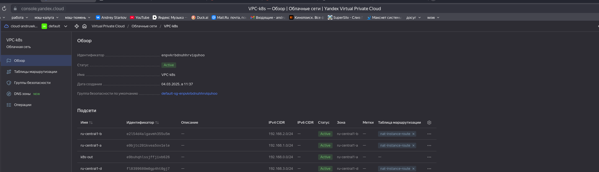
* 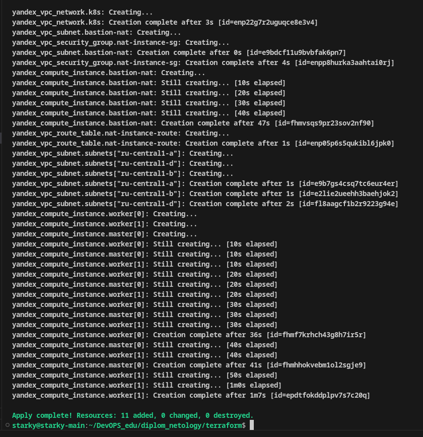
* 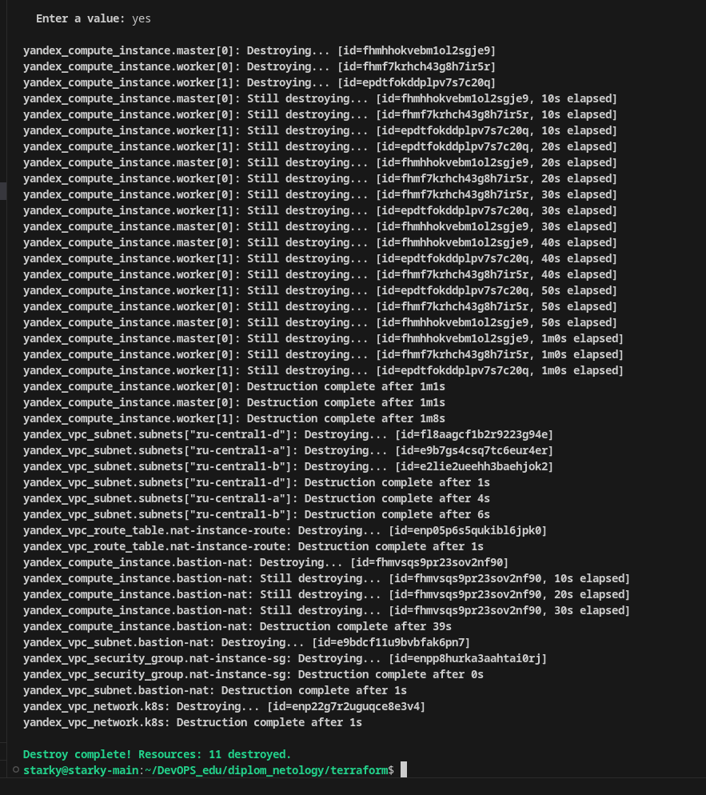
---
### 2.Создание Kubernetes кластера

На этом этапе необходимо создать Kubernetes кластер на базе предварительно созданной инфраструктуры.   Требуется обеспечить доступ к ресурсам из Интернета.

Ожидаемый результат:

1. Работоспособный Kubernetes кластер.
2. В файле `~/.kube/config` находятся данные для доступа к кластеру.
3. Команда `kubectl get pods --all-namespaces` отрабатывает без ошибок.
---
## 2.Решение
За основу была взята роль для [ansible](https://vk.com/@kodepteam-sozdanie-kubernetes-klastera-pri-pomoschi-ansible-rolei-i-mu) и переделаны под [актуальное](./ansible/k8s-cluster/) состояние (например настройка сети и т.д.)
запускать playbook необходимо с параметром:
```ansible-playbook -i hosts.yml ./k8s-cluster/playbook.yml --ssh-common-args='-o StrictHostKeyChecking=no' ```
* 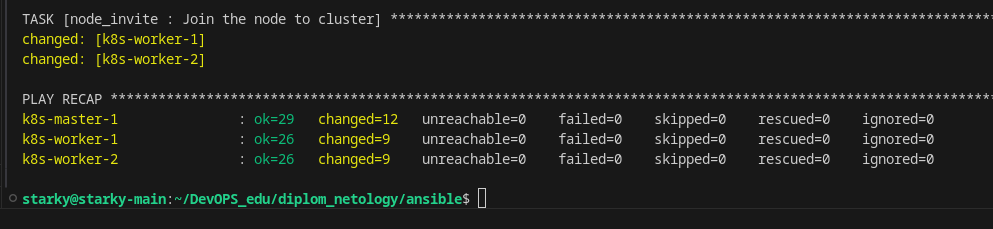
* 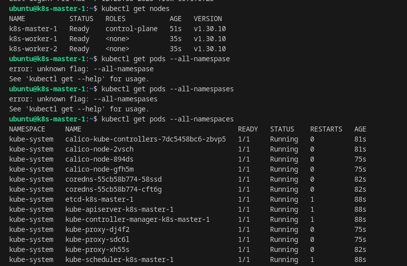

---
### 3.Создание тестового приложения

Для перехода к следующему этапу необходимо подготовить тестовое приложение, эмулирующее основное приложение разрабатываемое вашей компанией.

Ожидаемый результат:

1. Git репозиторий с тестовым приложением и Dockerfile.
2. Регистри с собранным docker image. В качестве регистри может быть DockerHub или Yandex Container Registry, созданный также с помощью terraform.

---
## 3.Решение
Созданное приложение с nginx лежит в репозитории [app_for_diplom](https://github.com/starky29/app_for_diplom)
Подготовил образ
* 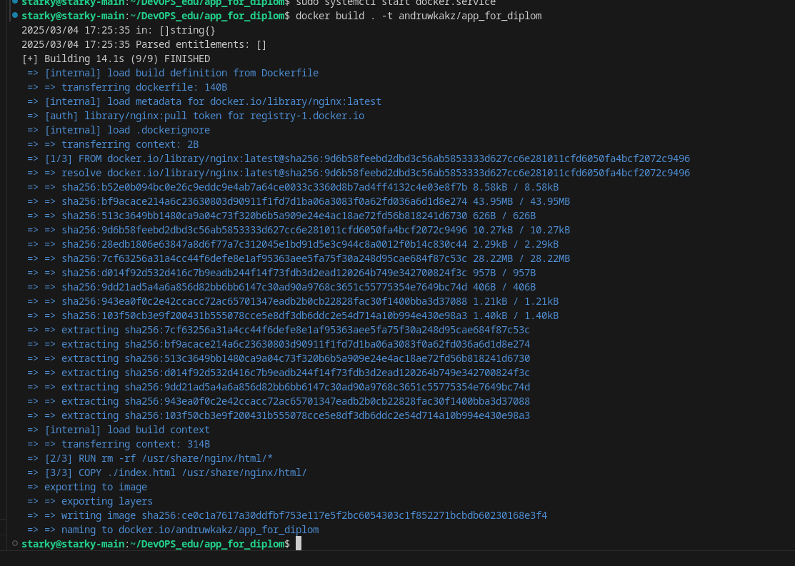
Загрузил образ
* 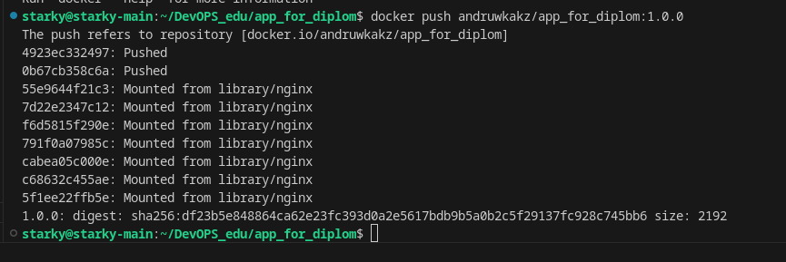
* 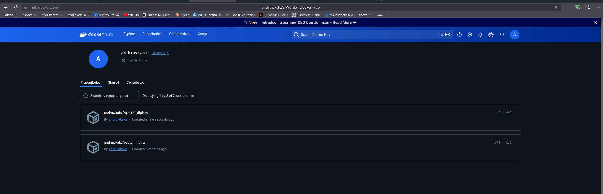
Проверил работу образа
* 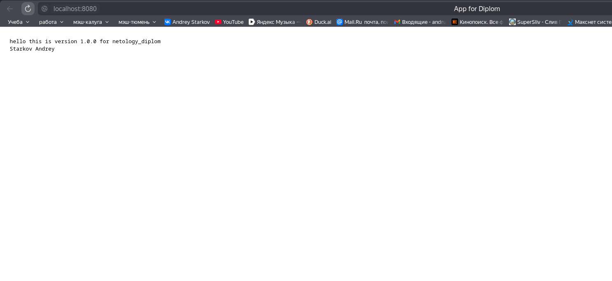
  
---
### 4.Подготовка cистемы мониторинга и деплой приложения

Уже должны быть готовы конфигурации для автоматического создания облачной инфраструктуры и поднятия Kubernetes кластера.  
Теперь необходимо подготовить конфигурационные файлы для настройки нашего Kubernetes кластера.

Цель:
1. Задеплоить в кластер prometheus, grafana, alertmanager, экспортер основных метрик Kubernetes.
2. Задеплоить тестовое приложение, например, nginx сервер отдающий статическую страницу.

Ожидаемый результат:
1. Git репозиторий с конфигурационными файлами для настройки Kubernetes.
2. Http доступ на 80 порту к web интерфейсу grafana.
3. Дашборды в grafana отображающие состояние Kubernetes кластера.
4. Http доступ на 80 порту к тестовому приложению.
5. Atlantis или terraform cloud или ci/cd-terraform
---
## 4.Решение
 Добавил роль [gaps](./ansible/k8s-cluster/roles/gaps/) в ansible-playbook для диплоя [kube-prometheus](https://github.com/prometheus-operator/kube-prometheus) в кластер
* 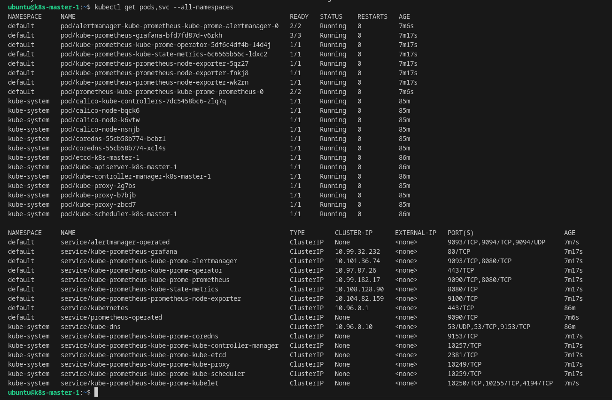
Для того что бы вывести наружу сервисы создал [балансер](./terraform/balancer.tf) и задеплоил [nginx-controller](./manifests/ing-mon-nginx.yaml)
Изменил сервис для графаны под настройки своего балансера [grafana-svc](./manifests/garafana-svc.yaml), а так же [ингресс](./manifests/ingres-monitoring.yaml)
* 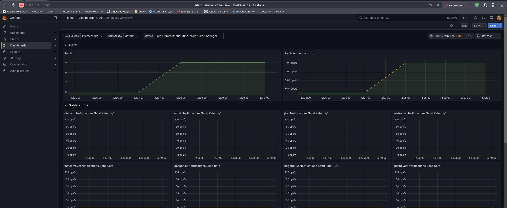
Задеплоил [приложение](./manifests/app.yaml)
* 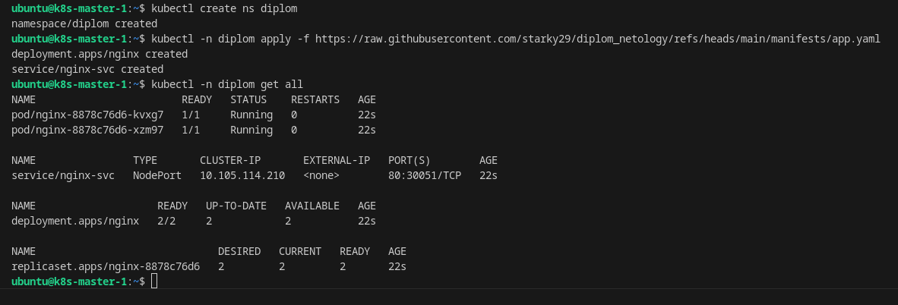 
* 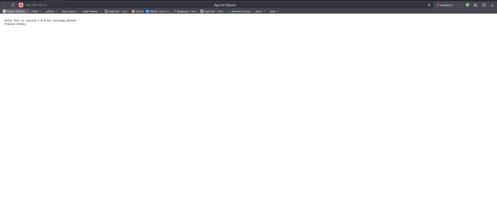
  

---
### 5.Установка и настройка CI/CD

Осталось настроить ci/cd систему для автоматической сборки docker image и деплоя приложения при изменении кода.

Цель:

1. Автоматическая сборка docker образа при коммите в репозиторий с тестовым приложением.
2. Автоматический деплой нового docker образа.

Ожидаемый результат:

1. Интерфейс ci/cd сервиса доступен по http.
2. При любом коммите в репозиторие с тестовым приложением происходит сборка и отправка в регистр Docker образа.
3. При создании тега (например, v1.0.0) происходит сборка и отправка с соответствующим label в регистри, а также деплой соответствующего Docker образа в кластер Kubernetes.
---
## 5.Решение

---